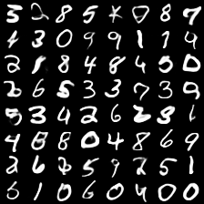
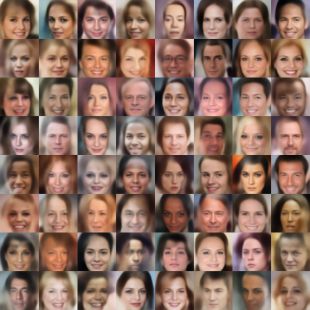

# Adversarial Variational Bayes
This repository contains the code to reproduce the core results from the paper [Adversarial Variational Bayes: Unifying Variational Autoencoders and Generative Adversarial Networks](https://arxiv.org/abs/1701.04722).


# Dependencies
Before running the code, you have to install
* [Tensorflow 1.0](https://www.tensorflow.org/)
* [Numpy](http://www.numpy.org/)
* [Scipy](https://www.scipy.org/)
* [Matplotlib](http://matplotlib.org/)
* [tqdm](https://pypi.python.org/pypi/tqdm)
* [ite-toolbox](https://bitbucket.org/szzoli/ite-in-python/)

The former 5 dependencies can be installed using pip by running
```
pip install tensorflow-gpu numpy scipy matplotlib tqdm
```

# Usage
Scripts to start the experiments can be found in the `experiments` folder. If you have questions, please
open an issue or write an email to lmescheder@tuebingen.mpg.de.

## MNIST
To run the experiments for mnist, you first need to create tfrecords files for MNIST:
```
cd tools
python download_mnist.py
```
Example scripts to run the scripts can be found in the `experiments` folder.

*NOTE*: the paper uses the `conv0` architecture for the encoder and decoder for the MNIST experiments, whereas the example scripts by default use the `conv1` architecture, as it is simpler and therefore faster to train. The `conv1` architecture is a reimplementation of the architecture used in the [Markov Chain Monte Carlo and Variational Inference:Bridging the Gap](http://www.jmlr.org/proceedings/papers/v37/salimans15.pdf) paper.
Using this architecture, we achieve an approximate ELBO of -82.3+-0.3 and an AIS score of -81.8+-0.4 for a 32-dimensional latent space with adaptive contrast.

Samples:



## CelebA
To run the experiments on celebA, first download the dataset from [here](http://mmlab.ie.cuhk.edu.hk/projects/CelebA.html) and put all the images in the `datasets/celebA` folder.

Samples:



Interpolations:


